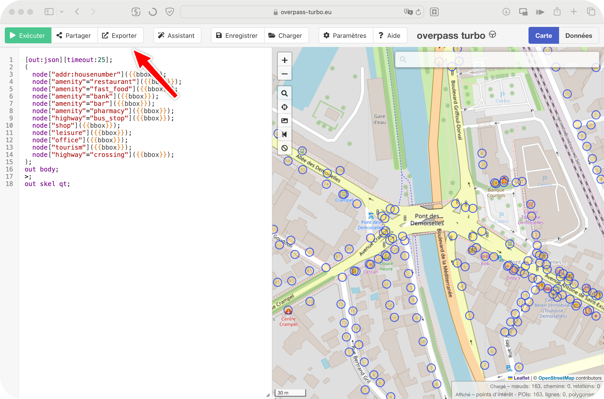
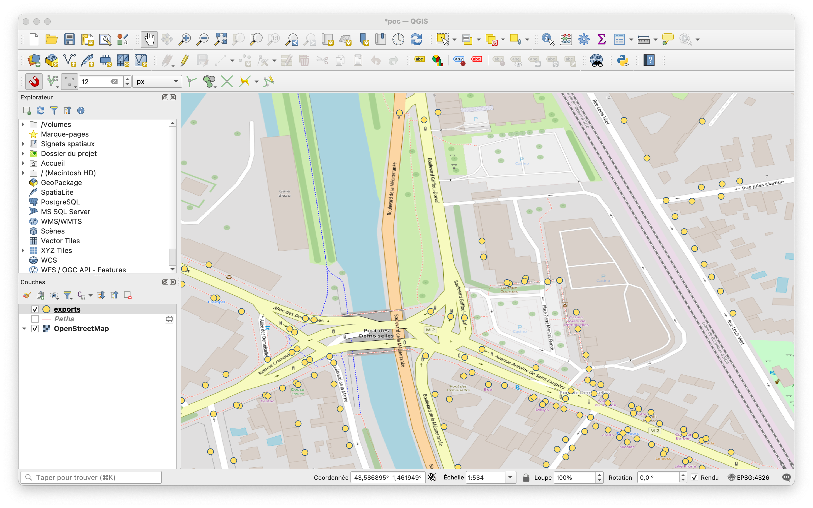
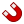
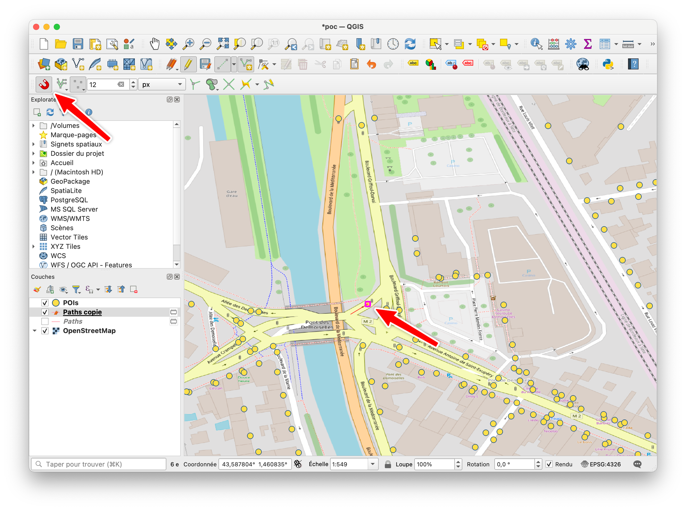
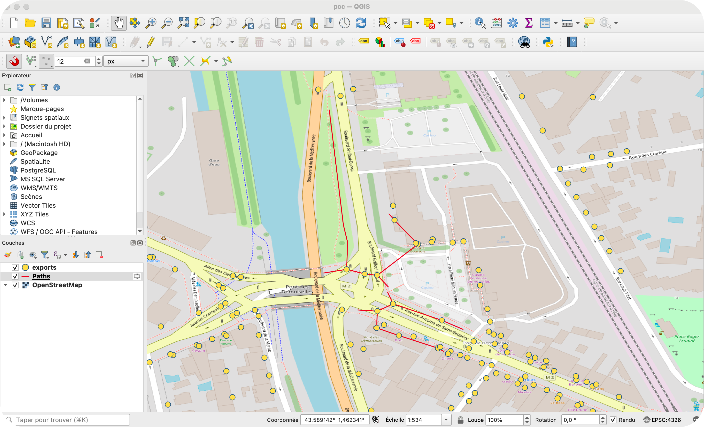
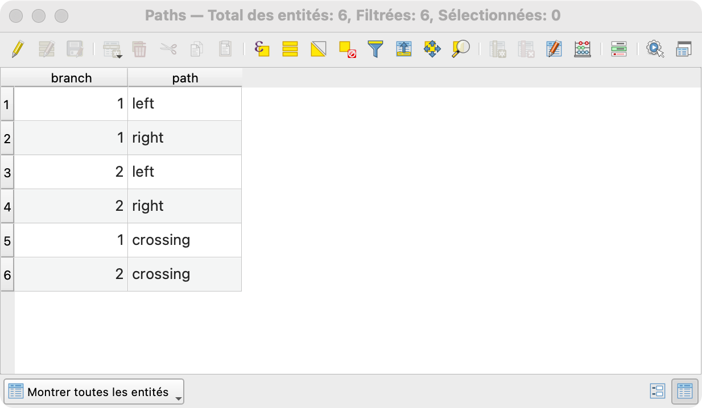
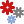
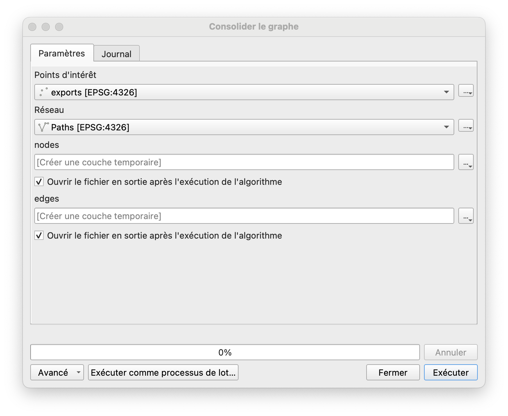
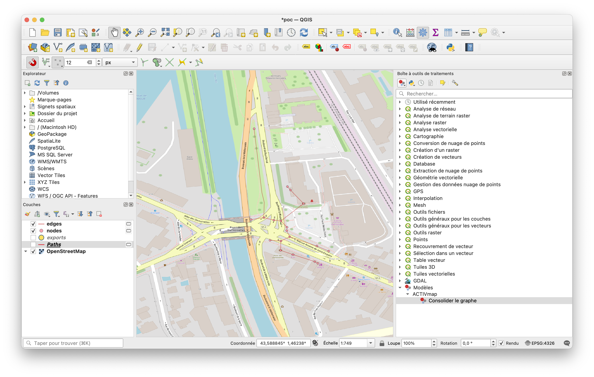
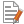

# Génération d'un fichier DERi

Prérequis:
- QGIS (version 3.34)

## 1. Télécharger le fichier des POIs

Sur Overpass Turbo, déplacer la carte sur l'emprise du carrefour puis exécuter la requête suivante :

```graphql
[out:json][timeout:25];
(
  node["amenity"="restaurant"]({{bbox}});
  node["amenity"="fast_food"]({{bbox}});
  node["amenity"="bank"]({{bbox}});
  node["amenity"="bar"]({{bbox}});
  node["amenity"="pharmacy"]({{bbox}});
  node["highway"="bus_stop"]({{bbox}});
  node["shop"]({{bbox}});
  node["highway"="crossing"]({{bbox}});
);
out body;
>;
out skel qt;
```



Puis cliquer sur Exporter et Télécharger dans la catégorie GeoJSON.

## 2. Dessiner le graphe sur QGIS

Ouvrir le template fourni avec QGIS, et ajouter au projet l'export GeoJSON téléchargé.



Éditer la couche "Paths" et dessiner les trottoirs gauche et droite de chaque branche en reliant ensemble les points que vous voulez intégrer au graphe. Il faut dessiner depuis l'intérieur vers l'extérieur du trottoir, en laissant un segment avant le premier point, et après le dernier.

:warning: **Attention** : Il faut que chaque point de la ligne corresponde bien au point de la couche GeoJSON. Pour cela, il faut activer la barre d'outil "Accrochage" (clic droit sur une des barres d'outils QGIS, "Barre d'outils", et cocher "Accrochage") et activer le symbôle d'aimant .



La couche comprend deux attributs: branch et path. branch correspond à la branche dessinée. Il s'agira d'un numéro à partir de 1. path correspond au trottoir dessiné, et prendra la valeur left ou right. Il prendra également la valeur crossing si le chemin dessiné est une traversée de branche.

:warning: **Attention** : Les traversées doivent passer par des passages piéton. Il est important de les dessiner du trottoir de gauche vers le trottoir de droite.




## 3. Exécuter le script de création du graphe

Ouvrez la boîte à outils , cliquer sur  puis "Ajouter un modèle à la boîte à outils". Sélectionner le fichier "consolider_graphe.model3". Une nouvelle section Modèles est apparue dans la boîte à outils. En la dépliant, on y trouve "ACTIVmap", puis "Consolider le graphe".

Exécuter "Consolider le graphe" en indiquant en entrée pour "Points d'intérêt" la couche GeoJSON, et pour "Réseau" la couche "Paths".



La couche "nodes" générée ajoute pour chaque trottoir un point de départ et un point d'arrivée (l'id est toujours de la forme start/end_numérobranche_left/right, par exemple end_2_right). La couche edges complète la couche Paths de champs start et end qui indiquent quels nodes (id) correspondent à l'extrémité de chaque chemin. 



## 4. Exécuter le script de création du DERi

Dans les menu de QGIS, aller dans "Extensions", "Console Python" pour ouvrir la console Python. Cliquer sur le symbole  pour ouvrir l'éditeur Python. Cliquer sur  et ouvrir le script "generer_deri.py". Éditer la ligne 104 pour indiquer le chemin absolu où se trouve le fichier "configuration.json".

Éditer le fichier "configuration.json". Les tailles et positions sont données en pixels. Pour chaque point d'interaction, préciser la couche "layer" DERi à laquelle sera ajoutée l'interaction (pour chaque occurence différente de layer, une nouvelle cuche sera créée), puis préciser dans resource l'id de la couche "node" que l'on veut déclencher (le point de départ gauche d'une branche en général, par exemple start_1_left). Exemple de fichier:

```json
{
	"title":"Test PoC",
	"version":2.0,
	"image":"map.png",
	"shape":["square",40,40],
	"interactions":[
		{
			"layer":"graphe",
			"location":[1380,580],
			"resource":"start_1_left"
		},
		{
			"layer":"graphe",
			"location":[1390, 680],
			"resource":"start_2_left"
		}
	]
}
```

Enfin, dans QGIS, exécuter le script. On trouve enfin dans le chemin renseigné le fichier "deri.json".